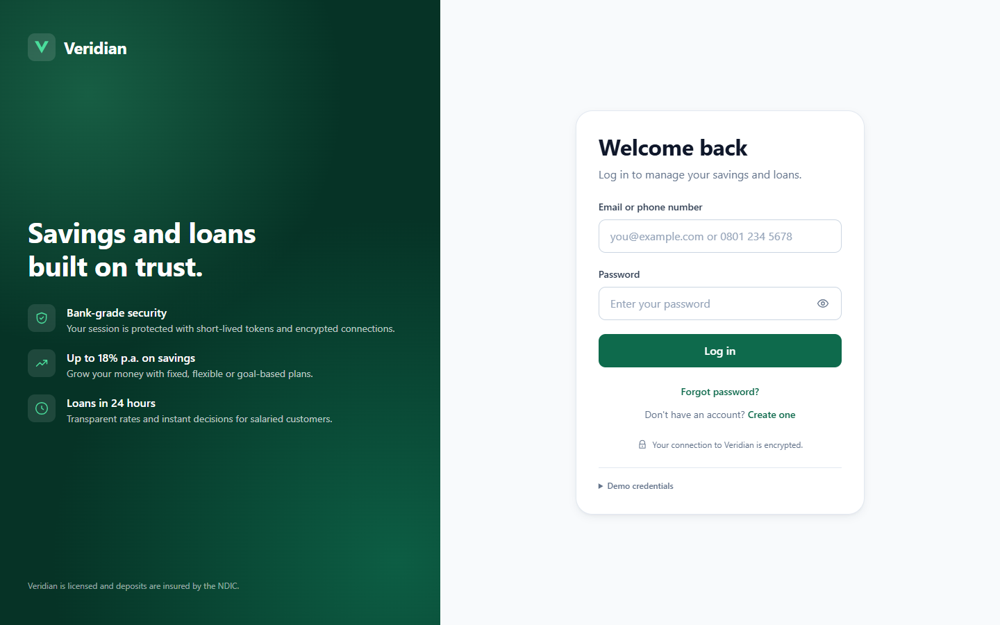
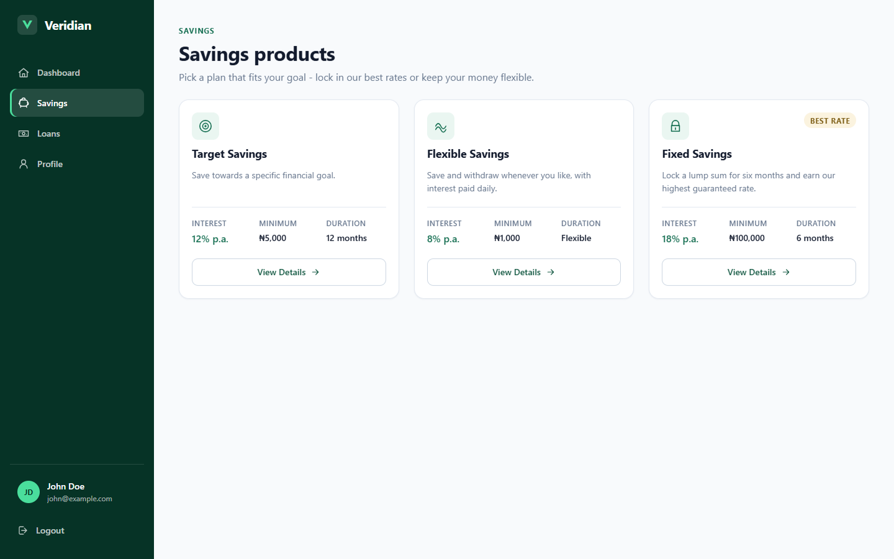
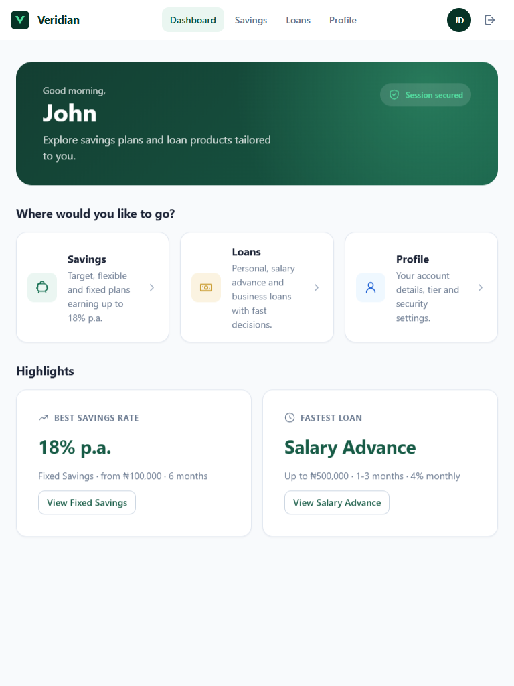
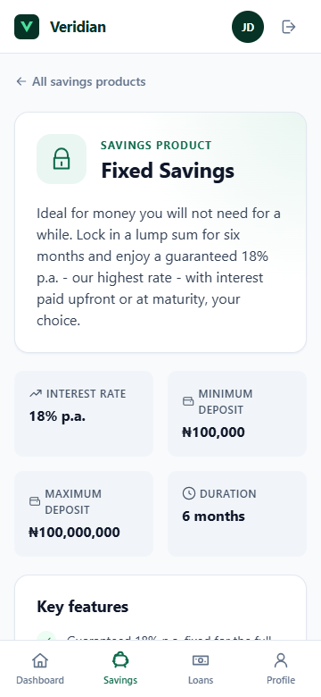
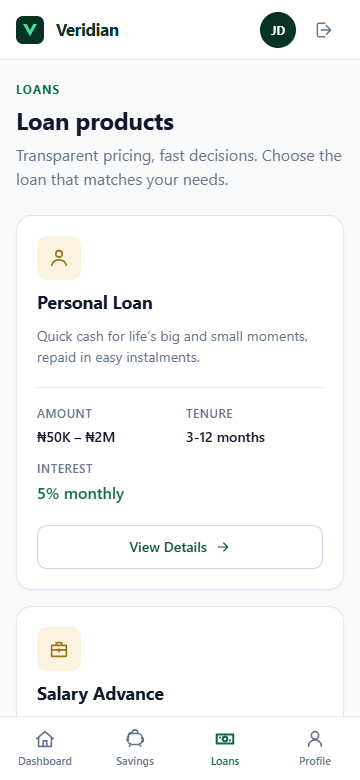

# Veridian — Fintech Web Application

A responsive, customer-facing web app for a digital financial institution. Customers log in, explore savings and loan products, open product details and trigger authenticated actions ("Start Saving", "Apply for Loan") against a mock **NestJS** REST API.

Built with **React 19 + TypeScript + Vite** (frontend) and **NestJS 11** (mock API) as an npm-workspaces monorepo.

**Live demo:** https://veridian-fintech.onrender.com — sign in with `john@example.com` / `Password123!` (or click **Use demo account**). Hosted on Render's free tier, so the first visit after a quiet period takes ~30–50 s to wake up.

| Login (desktop) | Savings (desktop) |
| --- | --- |
|  |  |

| Dashboard (tablet) | Savings detail (mobile) | Loans (mobile) |
| --- | --- | --- |
|  |  |  |

More screenshots (loading, error, validation, modal, every breakpoint) are in [`docs/screenshots`](docs/screenshots).

---

## Table of contents

1. [Project overview](#1-project-overview)
2. [Setup](#2-setup)
3. [Architecture](#3-architecture)
4. [State management](#4-state-management)
5. [Security](#5-security)
6. [Performance](#6-performance)
7. [Testing](#7-testing)
8. [Production improvements](#8-production-improvements)
9. [Deployment](#9-deployment)
10. [API reference](#10-api-reference)
11. [Deliverables checklist](#11-deliverables-checklist)

---

## 1. Project overview

**What was built**

| Area | Delivered |
| --- | --- |
| Login | Email **or** phone number + password (show/hide), client-side validation, inline API errors, forgot-password / register links (placeholder pages) |
| Dashboard | Greeting, quick links, live highlights (best savings rate, fastest loan) fed from the same cached queries as the product pages |
| Savings | Product cards (name, rate, minimum, duration, description, *View Details*) → detail page (max deposit, key features, terms) → **Start Saving** confirmation modal calling an authenticated endpoint |
| Loans | Product cards (range, tenure, interest) → detail page (eligibility, requirements, disbursement) → **Apply for Loan** confirmation modal |
| Profile | `GET /users/me` with server-masked identifiers (phone, account number, BVN), tier, logout |
| Navigation | Sidebar (≥1024px), top bar with inline links (768–1023px), bottom tab bar (<768px), skip link, `aria-current` |
| Loading | Content-shaped skeletons for grids, detail pages and route chunks; button loading states; disabled states. No full-page spinners |
| Errors | Every failure mapped to a user-safe message (400/401/403/404/429/5xx/offline) with a **Try again** action; raw transport errors never reach the UI |
| Auth | Short-lived JWT access token in memory + HttpOnly `SameSite=Strict` refresh cookie with rotation and server-side revocation; silent refresh + retry on 401; session restore across reloads |
| API | NestJS mock API: `POST /auth/login`, `/auth/refresh`, `/auth/logout`, `GET /users/me`, `GET /savings-products[/:id]`, `POST /savings-products/:id/start`, `GET /loan-products[/:id]`, `POST /loan-products/:id/apply`, `GET /health` |
| Tests | 13 API e2e (supertest), 25 unit/component/integration (Vitest + Testing Library + MSW), 10 Playwright E2E against the production build |
| Perf | Route-level code splitting, vendor chunking, query caching, Lighthouse 97–100 (mobile) / 100 (desktop) — see [§6](#6-performance) |

**Demo credentials**

| Identifier | Password |
| --- | --- |
| `john@example.com` (or phone `08012345678`) | `Password123!` |
| `demo@veridian.app` (or phone `08098765432`) | `Password123!` |

---

## 2. Setup

Requirements: **Node.js ≥ 20** and npm ≥ 10. Chrome (any recent version) is only needed for the Playwright E2E and Lighthouse scripts.

```bash
npm install
npm run dev
```

`npm run dev` starts both servers with one command:

| Service | URL | Notes |
| --- | --- | --- |
| Web (Vite) | http://localhost:5173 | Proxies `/api/*` → API |
| API (NestJS) | http://localhost:3000 | `MOCK_LATENCY_MS=600` by default so loading states are visible |

Open http://localhost:5173 and sign in with the demo credentials.

**No local setup? Run it inside GitHub.** On the repository page click **Code → Codespaces → Create codespace on main**. The dev container installs dependencies, starts both servers and opens the forwarded web app URL in a new tab (allow ~2 minutes on first boot). Sign in with the demo credentials.

Other commands (run from the repo root):

| Command | What it does |
| --- | --- |
| `npm run build` | Production build of both packages (`web/dist`, `api/dist`) |
| `npm test` | API e2e suite + web unit/component/integration suite |
| `npm run test:e2e` | Playwright E2E (builds the web app, starts the API on :3100 and `vite preview` on :4173) |
| `npm run screenshots --workspace web` | Regenerates `docs/screenshots` at 1440 / 768 / 360 px |
| `npm run perf --workspace web` | Lighthouse audit of public + authenticated pages → `docs/lighthouse` |
| `npm run lint` / `npm run typecheck` | ESLint (TS, hooks, jsx-a11y) and `tsc` for both packages |
| `npm run start:prod` | Serves the production build of both packages from one process (see [§9](#9-deployment)) |

Environment variables are documented in [`api/.env.example`](api/.env.example) and [`web/.env.example`](web/.env.example); every value has a safe development default, so no `.env` file is required.

> **Dev-only helpers on the API:** send `X-Simulate-Status: 500` (or `?simulate=503`) on any request to see the UI's error handling, and set `MOCK_LATENCY_MS=0` to remove the artificial delay. Both are ignored when `NODE_ENV=production`.

---

## 3. Architecture

```
fintech-assessment/
├── api/                      NestJS mock REST API
│   ├── src/
│   │   ├── auth/             login / refresh / logout, JWT issuing, session revocation
│   │   ├── users/            user records (hashed passwords), profile projection with masking
│   │   ├── savings-products/ catalogue + authenticated "start plan" action
│   │   ├── loan-products/    catalogue + authenticated "apply" action
│   │   ├── common/           JwtAuthGuard (global), CsrfHeaderGuard, error filter,
│   │   │                     dev-only latency / simulated-error interceptor
│   │   └── main.ts           helmet, CORS allow-list, cookie parser, validation pipe
│   └── test/                 supertest e2e suite
├── web/                      React 19 + TypeScript + Vite
│   ├── src/
│   │   ├── components/       ui/ (Button, TextField, Modal, Skeleton, ErrorState, Toaster…)
│   │   │                     products/ (cards, detail blocks, confirm modal)
│   │   │                     nav/ (Sidebar, TopBar, BottomNav), auth/ (LoginForm)
│   │   ├── pages/            one lazily-loaded component per route
│   │   ├── layouts/          AppShell (authenticated frame), AuthLayout (login split)
│   │   ├── routes/           router (lazy routes), guards, Root, RouteErrorPage
│   │   ├── services/         http client, session refresh, auth/products/users services
│   │   ├── hooks/            TanStack Query hooks, queryKeys, useAuth, useSessionBootstrap
│   │   ├── store/            Zustand stores: auth (in-memory token), ui (toasts)
│   │   ├── types/            API contracts shared by services, hooks and components
│   │   ├── utils/            errors (ApiError + user messages), format, validation
│   │   ├── styles/           tokens.css (design tokens) + global.css
│   │   └── test/             MSW handlers, fixtures, render helpers, integration tests
│   ├── e2e/                  Playwright specs (+ screenshot generator)
│   └── scripts/lighthouse.mjs
└── docs/                     screenshots/, lighthouse/
```

### Key decisions

**Layered frontend.** Pages compose components and hooks; hooks call services; services call one `http` client. Components never touch `fetch` or tokens, which keeps auth and error handling in exactly one place ([`web/src/services/http.ts`](web/src/services/http.ts)).

**One error type for the whole UI.** The http client converts *every* failure (non-2xx, JSON parse, offline) into an `ApiError` with a `kind` (`network | bad_request | unauthorized | forbidden | not_found | rate_limited | server | unknown`) and a message that is already safe to render ([`web/src/utils/errors.ts`](web/src/utils/errors.ts)). Only 400/401 messages written by our own API are echoed; anything else gets generic copy. The UI therefore cannot leak `AxiosError: Request failed with status code 500`.

**Route = chunk.** Every page is registered with React Router's `lazy`, so `/savings` downloads the shell + the savings chunk only ([`web/src/routes/router.tsx`](web/src/routes/router.tsx)). The Suspense boundary sits *inside* `AppShell`, so navigation never flashes while a chunk loads.

**Native `<dialog>` for modals.** Focus trapping, `Escape`, the top layer and inert background come from the platform instead of a library ([`web/src/components/ui/Modal.tsx`](web/src/components/ui/Modal.tsx)).

**Plain CSS with design tokens.** All colour, spacing, type and radius values live in [`tokens.css`](web/src/styles/tokens.css); components use CSS Modules for scoping. No CSS framework — smaller bundle, and the assessment asks for CSS3 competence. System font stack: zero font requests, native rendering (a deliberate *Speed* choice).

**Same-origin API path.** The browser always calls `/api/*`; Vite (dev/preview) or a reverse proxy (prod) forwards it to NestJS. This keeps cookies first-party (`SameSite=Strict` works), removes CORS from the browser's point of view and makes the API base URL a deployment concern, not a code concern.

**NestJS "secure by default".** `JwtAuthGuard` is registered as a global `APP_GUARD`; a route is only public if explicitly decorated with `@Public()`. Adding a new controller cannot accidentally expose data.

---

## 4. State management

**Chosen approach: TanStack Query (server state) + Zustand (global client state) + React local state (component state).**

| Kind | Examples | Where | Why |
| --- | --- | --- | --- |
| **Server state** | savings products, loan products, product details, user profile, start/apply mutations | TanStack Query (`hooks/use*`) | It *is* a cache of remote data: staleness, deduping, retries, background refetch, cancellation via `AbortSignal` and mutation lifecycle are solved problems. Rebuilding them in Redux/Zustand would be more code with worse semantics. |
| **Global client state** | auth session (status, user, in-memory access token), toasts | Zustand (`store/auth.store.ts`, `store/ui.store.ts`) | Tiny API, no boilerplate, readable *outside* React (the http client reads the token and the session refresher writes the store without hooks), selector-based subscriptions avoid needless re-renders. |
| **Local / UI state** | form values + validation, password visibility, modal open/closed, logout-in-progress | `useState` in the owning component | It is not shared; lifting it globally would add coupling for nothing. |
| **URL state** | selected product (`/savings/:id`), the page the user wanted before login (`location.state.from`) | React Router | The URL is the source of truth for navigation state — shareable, refresh-safe, back-button friendly. |

Why not Redux Toolkit? Nothing in this app has complex, interdependent client state that benefits from reducers/middleware; the bulk of "state" is server data, which RTK Query and TanStack Query both handle — TanStack Query does it without pulling in the Redux runtime.

**How server state is handled**

- One query-key factory ([`hooks/queryKeys.ts`](web/src/hooks/queryKeys.ts)); keys are hierarchical so `['savings-products']` invalidation also covers `['savings-products', id]`.
- `staleTime: 5 min`, `gcTime: 30 min`, `refetchOnWindowFocus: false` — product catalogues change rarely, so switching Savings → Dashboard → Savings serves the cache instead of calling `GET /savings-products` again (verified by an E2E test).
- Retries only for transient failures (network / 5xx), never for 4xx.
- Detail pages use the matching list item as `placeholderData`, so the header renders instantly while features/terms load.
- Mutations (`useStartSaving`, `useApplyForLoan`) expose `isPending / isError` which drive the button loading state and inline error in the confirm modal.
- On logout `queryClient.clear()` drops every cached response belonging to the previous user.

---

## 5. Security

A fintech frontend cannot be trusted; every control below is mirrored (or solely enforced) on the server.

### Authentication & token handling

**Implemented (mock, but production-shaped):**

1. `POST /auth/login` validates credentials (passwords are stored **scrypt-hashed**, compared with `timingSafeEqual`) and returns a **15-minute JWT access token in the body** plus a **7-day refresh token in an `HttpOnly; SameSite=Strict; Secure(prod)` cookie**.
2. The SPA keeps the access token **in memory only** (Zustand store). It is never written to `localStorage`/`sessionStorage`.
3. The `http` client attaches `Authorization: Bearer …`. On a `401` it calls `POST /auth/refresh` **once** (single-flight, so ten concurrent 401s trigger one refresh), stores the new token and retries the original request. If refresh fails the session is cleared and the router redirects to `/login`.
4. `/auth/refresh` **rotates** the refresh token and revokes the previous session id server-side, so a stolen refresh token can be used at most once. `/auth/logout` revokes it and clears the cookie.
5. On boot the app silently calls `/auth/refresh` to restore the session across reloads — but only if a non-sensitive `vf:has-session=1` hint exists in `localStorage`, so first-time visitors skip a pointless round-trip. The hint contains no credential.

**Storage options and why this split:**

| Store | XSS can read it? | CSRF exposure | Survives reload | Verdict |
| --- | --- | --- | --- | --- |
| `localStorage` | **Yes** — any injected script exfiltrates it | none | yes | Never for tokens. One XSS bug = full account takeover for as long as the token lives. |
| `sessionStorage` | **Yes** | none | tab only | Same problem, slightly smaller blast radius. |
| JS-readable cookie | **Yes** | yes | yes | Worst of both. |
| **HttpOnly cookie** | **No** | yes → needs CSRF defence | yes | Right home for the long-lived refresh token. |
| **In-memory** | Only while the page is open and only via the running app | none | no | Right home for the short-lived access token. |

Combining the two means an XSS payload can at worst use the session while the tab is open (it cannot steal a durable credential), and a CSRF attacker cannot read responses and cannot forge a bearer header.

### Protected routes

`RequireAuth` ([`routes/guards.tsx`](web/src/routes/guards.tsx)) wraps every authenticated route: `unknown` status shows a splash while the boot-time refresh runs, `anonymous` redirects to `/login` and remembers `from` so the user returns to the page they wanted. `RedirectIfAuthenticated` keeps signed-in users off `/login`.

This is a **UX guard only**. Bypassing it (or `if (user.isAdmin) showAdminButton`) gains nothing: the API's global `JwtAuthGuard` rejects every request without a valid token, and product actions take the user id from the *verified token subject*, never from the request body, so a customer cannot act on someone else's behalf. Authorization (roles, ownership, limits) must always be enforced by the backend; the UI merely reflects it.

### XSS

- React escapes all interpolated values; the codebase contains **no `dangerouslySetInnerHTML`** and no `innerHTML`.
- API-provided text (descriptions, features, terms) is rendered as text nodes. If rich text were ever required it would be sanitised server-side *and* client-side (DOMPurify with an allow-list) before rendering.
- URLs are built with `encodeURIComponent`; no user input is placed in `href`s.
- The API sets **helmet** headers (CSP, `X-Content-Type-Options`, HSTS in prod). In production a strict CSP (`script-src 'self'`, no inline scripts) is added on the web origin as well.
- ESLint forbids `console.log`, so tokens or PII cannot be logged by accident.

### CSRF

Cookie-authenticated endpoints (`/auth/refresh`, `/auth/logout`) are protected in depth:

1. `SameSite=Strict` — the browser never attaches the cookie to cross-site requests.
2. `CsrfHeaderGuard` requires `X-Requested-With: XMLHttpRequest`. A cross-site `<form>`/`` cannot set custom headers; a cross-origin `fetch` would need a CORS preflight that the allow-list rejects.
3. Data endpoints use the bearer token, which an attacker's page cannot read or forge.

For a fully cookie-based session the same pattern extends with a synchroniser/double-submit token.

### CORS

The API's origin list is explicit (`CORS_ORIGINS`), `credentials: true`, methods and headers are enumerated — never `*`. In the recommended deployment the SPA and API are same-site behind one reverse proxy, so the browser never issues cross-origin requests at all.

### Sensitive data

- **Not in URLs**: routes carry product ids only; credentials and tokens travel in bodies/headers.
- **Not in storage**: see above; only a boolean hint is persisted.
- **Not in logs**: NestJS logger is limited to `error/warn/log`, bodies are never logged; the exception filter logs stack traces server-side only and returns a normalised envelope with generic messages for 5xx.
- **Not in responses**: `GET /users/me` returns masked identifiers (`******6789`, `********901`); `passwordHash`, `bvn`, `accountNumber` never leave the server (covered by API tests).
- **Not in error messages**: the login error is deliberately vague ("Incorrect email/phone number or password") so it does not confirm which identifier exists.
- **Not in source**: secrets come from environment variables; `.env` is git-ignored; the dev defaults are obviously fake.
- Login is **rate limited** (5 attempts / minute / IP) and the whole API at 100 req/min.

### Production hardening

- **HTTPS is mandatory**: without it bearer tokens, cookies and PII travel in clear text and can be read or modified by anyone on the path; `Secure` cookies and HSTS require it.
- **Token expiry**: 15-minute access tokens bound the damage of a leaked token; refresh tokens rotate on every use and are revocable (store session ids in Redis/DB instead of the in-memory `Map`).
- **Secure cookies**: `Secure` + `HttpOnly` + `SameSite=Strict`, scoped to the auth path.
- **Rate limiting** and **brute-force lockout** on login; **backend authorization** on every endpoint; audit logging of sensitive actions; secret rotation via a secrets manager; dependency scanning in CI.

---

## 6. Performance

### Page-load strategy

1. `index.html` (1 kB) → three long-lived vendor chunks (`react` 100 kB gz, `query` 10 kB gz, `vendor` <1 kB gz) + the app entry (**10 kB gz**) + the route chunk for the current page (0.5–2.3 kB gz). Vendor chunks are content-hashed, so app deploys do not invalidate the React chunk in users' caches.
2. First-time visitors go straight to the login page with **no API call** (session hint absent). Returning visitors make one `POST /auth/refresh`.
3. The page chunk downloads in parallel with the shell; skeletons render immediately; data requests start as soon as the page mounts.
4. No web fonts, no icon fonts, no images on the critical path — icons are inline SVG paths, the logo is an SVG.

### Code splitting & lazy loading

- **Route-level splitting** via `lazy` in the router: eight page chunks (see build output below).
- Vendor splitting via `manualChunks` in [`vite.config.ts`](web/vite.config.ts).
- Shared code between detail pages (`ProductDetail`) is automatically hoisted into its own chunk by Rollup.

### API caching

TanStack Query with a 5-minute `staleTime` — see [§4](#4-state-management). The E2E test *"navigating between sections reuses cached product data"* asserts that `GET /savings-products` and `GET /loan-products` are each called exactly once across Savings → Dashboard → Savings. In-flight requests are cancelled with `AbortSignal` when a page unmounts. List data is reused as placeholder data on detail pages.

### Rendering

- `ProductCard` / `SavingsProductCard` / `LoanProductCard` are wrapped in `React.memo`: the grid re-renders on every query state change while individual product props stay referentially stable.
- Zustand selectors (`selectStatus`, `selectUser`) subscribe components only to the slice they use.
- `useCallback` is used where a function is passed to memoised children or effects (`useAuth.logout`, `AppShell.handleLogout`); it is deliberately *not* sprinkled on every handler.
- Skeletons and toasts use CSS animations (compositor-only) and respect `prefers-reduced-motion`.

### Images

The app ships **no raster images**: the logo, favicon and all icons are SVG (resolution-independent, ~100 bytes each, inherit `currentColor`). Product illustrations are icon badges instead of photos. If marketing imagery were added it would be served as AVIF/WebP with explicit `width`/`height` (no CLS), `loading="lazy"` below the fold, and responsive `srcset`.

### Performance report

Production build (`vite build`), gzip sizes:

| Chunk | Size (gz) |
| --- | ---: |
| `react` (react, react-dom, react-router) | 100.4 kB |
| `query` (TanStack Query) | 10.4 kB |
| `index` (app shell, services, stores, UI kit) | 10.3 kB |
| `index.css` (tokens + global + shared UI) | 4.6 kB |
| `LoginPage` | 2.3 kB (+0.9 kB css) |
| `DashboardPage` | 1.8 kB (+1.0 kB css) |
| `ProductDetail` (shared by both detail pages) | 2.0 kB (+1.4 kB css) |
| `SavingsProductsPage` / `LoanProductsPage` | 0.6 kB each |
| `SavingsProductDetailPage` / `LoanProductDetailPage` | 1.4 kB each |
| `ProfilePage` | 1.5 kB (+0.7 kB css) |

Lighthouse 13 user-flow audit (`npm run perf --workspace web`) — production build, real API with no artificial latency, cold navigations after a real login. Mobile = Lighthouse's default throttling (slow 4G, 4× CPU); desktop = 10 Mbps / no CPU throttle. Full HTML reports: [`docs/lighthouse/mobile-flow.html`](docs/lighthouse/mobile-flow.html), [`docs/lighthouse/desktop-flow.html`](docs/lighthouse/desktop-flow.html).

| Page | Form factor | Perf | A11y | Best practices | FCP | LCP | TBT | CLS |
| --- | --- | ---: | ---: | ---: | ---: | ---: | ---: | ---: |
| Login | mobile | 97 | 100 | 100 | 2.0 s | 2.1 s | 70 ms | 0 |
| Dashboard | mobile | 99 | 100 | 100 | 1.2 s | 1.6 s | 80 ms | 0 |
| Savings | mobile | 100 | 100 | 100 | 1.1 s | 1.5 s | 40 ms | 0 |
| Savings detail | mobile | 98 | 100 | 100 | 1.1 s | 1.6 s | 130 ms | 0 |
| Loans | mobile | 100 | 100 | 100 | 1.1 s | 1.5 s | 50 ms | 0 |
| Profile | mobile | 100 | 100 | 100 | 1.1 s | 1.4 s | 60 ms | 0 |
| Login | desktop | 100 | 100 | 100 | 0.5 s | 0.6 s | 0 ms | 0 |
| Dashboard | desktop | 100 | 100 | 100 | 0.3 s | 0.4 s | 0 ms | 0 |
| Savings | desktop | 100 | 100 | 100 | 0.3 s | 0.4 s | 0 ms | 0 |
| Savings detail | desktop | 100 | 100 | 100 | 0.3 s | 0.4 s | 0 ms | 0 |
| Loans | desktop | 100 | 100 | 100 | 0.3 s | 0.4 s | 10 ms | 0 |
| Profile | desktop | 100 | 100 | 100 | 0.3 s | 0.4 s | 0 ms | 0 |

Observations:

- The login page is the true cold start (131 kB transferred). Subsequent pages transfer 6–12 kB because the hashed vendor chunks are already cached — which is exactly what the chunking strategy is for.
- CLS is 0 everywhere: skeletons reserve the space the real content occupies.
- The accessibility audit initially flagged two contrast issues (gold badge text, muted fact labels) and an `h1 → h3` heading jump on cards; all three were fixed and the score is now 100 on every page.
- Chrome DevTools (Network tab) shows one request per product list per session and route chunks loading only on navigation — the same behaviour the E2E caching test asserts programmatically.

---

## 7. Testing

```bash
npm test                              # API e2e + web unit/component/integration
npm run test:e2e                      # Playwright E2E (uses installed Chrome)
```

### API — `api/test/app.e2e-spec.ts` (Jest + supertest, 13 tests)

Login (email + phone, 401 on bad credentials, 400 validation, cookie flags), 401 without/with tampered token, product lists and details (incl. 404), profile masking (no `bvn`/`accountNumber`/`passwordHash` in responses), authenticated actions with business validation, refresh requires the CSRF header, refresh-token rotation and logout revocation, error envelope never leaks stack traces, login rate limiting (429).

### Web — Vitest + Testing Library + MSW (25 tests)

Unit — [`utils/validation.test.ts`](web/src/utils/validation.test.ts): identifier required, email format, local/international phone formats, password minimum length, aggregation.

Component:

- [`LoginForm.test.tsx`](web/src/components/auth/LoginForm.test.tsx) — required-field errors + focus management, blur validation and error clearing, show/hide password keeps the value, loading/disabled state during submit, friendly 401 message with password cleared and refocused, transport errors never rendered raw.
- [`SavingsProductsPage.test.tsx`](web/src/pages/SavingsProductsPage.test.tsx) — skeleton with accessible status → three cards with name/rate/minimum/duration/description/link; 500 → friendly error + **Try again** recovers.
- [`LoanProductsPage.test.tsx`](web/src/pages/LoanProductsPage.test.tsx) — cards with range/tenure/interest; 403 and offline messages.

Integration over the **real route tree** ([`test/app.integration.test.tsx`](web/src/test/app.integration.test.tsx)): protected route → `/login` → back to the requested page after login; successful login lands on the dashboard with nothing but the boolean hint in storage; failed login; 429 handling; product API failure + retry; silent 401 → refresh → retry (asserts the CSRF header and rotated token); forced sign-out when refresh fails; logout clears everything; Start Saving confirm → success toast.

### E2E — Playwright against the production build (10 tests)

[`web/e2e`](web/e2e): successful login (and proof the refresh cookie is not JS-readable), failed login, client validation, protected-route redirect/return, session restore across reload + logout, savings and loan detail actions (asserts the `Authorization` header on the authenticated POST), API failure → retry, unknown product → not-found page, and query caching across navigation. Runs with the installed Chrome (`channel: 'chrome'`), so there is no browser download.

---

## 8. Production improvements

With another two weeks I would:

1. **Real backend integration** — persistent users/sessions (Postgres + Redis for refresh-token sessions), OpenAPI spec generated from the Nest DTOs and typed client generation so frontend types can never drift from the API.
2. **Auth hardening** — MFA/OTP on login and on money-moving actions, device/session management page ("sign out everywhere"), anomaly-based lockouts, `Secure` cookie path scoping, strict CSP with nonces, Subresource Integrity, dependency and secret scanning in CI.
3. **Complete the flows** — registration and password reset, "Start Saving" with amount/frequency and funding, loan application form with document upload and status tracking, real dashboard balances.
4. **Observability** — Sentry (with PII scrubbing) for the SPA and API, web-vitals reporting from real users, structured API logs with request ids, uptime checks.
5. **CI/CD** — GitHub Actions running lint, typecheck, unit, API, E2E and Lighthouse budgets (`lighthouse-ci` assertions) on every PR; preview deployments per branch on top of the existing Docker/Render setup.
6. **Accessibility pass** — screen-reader testing (NVDA/VoiceOver), automated axe checks in Playwright, reduced-motion review, a formal WCAG 2.2 AA audit.
7. **Product polish** — dark mode via the existing token layer, i18n/l10n (currency and number formats already go through `Intl`), offline/poor-network states with a persisted query cache, prefetching route chunks on link hover.
8. **Testing depth** — visual regression (Playwright snapshots), contract tests between web and API, mutation testing for the validation/error-mapping utilities.

---

## 9. Deployment

The repo ships as **one container** that serves both the API and the built frontend from a single origin, so the secure-cookie login works exactly as it does locally (`/api/*` → NestJS, everything else → the SPA).

### Render (free tier, ~2 minutes)

1. Push this repository to GitHub.
2. In Render: **New → Blueprint**, pick the repo, click **Apply**. [`render.yaml`](render.yaml) provisions the service, generates the JWT secrets and sets the health check (`/api/health`).
3. Open the URL Render gives you (this repo is deployed at https://veridian-fintech.onrender.com) and sign in with the demo credentials.

Railway, Fly.io and any Docker host work the same way — point them at the [`Dockerfile`](Dockerfile) and set `JWT_ACCESS_SECRET` / `JWT_REFRESH_SECRET`.

### Run the production build locally

```bash
npm run build
SERVE_WEB=true NODE_ENV=production JWT_ACCESS_SECRET=change-me JWT_REFRESH_SECRET=change-me node api/dist/main
```

or with Docker:

```bash
docker build -t veridian .
docker run -p 3000:3000 -e JWT_ACCESS_SECRET=change-me -e JWT_REFRESH_SECRET=change-me veridian
```

Then open http://localhost:3000. In this mode the API is mounted under `/api`, hashed assets are served with immutable caching, `index.html` is always revalidated, and every non-API route falls back to the SPA so deep links such as `/savings/3` work.

### Environment variables (production)

| Variable | Purpose |
| --- | --- |
| `NODE_ENV=production` | Secure cookies, disables the dev-only latency / simulated-error helpers |
| `SERVE_WEB=true` | Serve `web/dist` from the API process (single-origin deployment) |
| `JWT_ACCESS_SECRET`, `JWT_REFRESH_SECRET` | Token signing secrets — **required**; the API refuses to start in production without them (or with the `change-me` placeholders) |
| `JWT_ACCESS_TTL`, `JWT_REFRESH_TTL` | Defaults `15m` / `7d` |
| `LOGIN_RATE_LIMIT` | Login attempts per minute per IP (default 5) |
| `CORS_ORIGINS` | Only needed if the SPA is hosted on a different origin |
| `PORT` | Injected by the host; the app listens on it |

---

## 10. API reference

All endpoints except `POST /auth/login`, `POST /auth/refresh`, `POST /auth/logout` and `GET /health` require `Authorization: Bearer <accessToken>`.

| Method | Path | Body | Response |
| --- | --- | --- | --- |
| POST | `/auth/login` | `{ identifier, password }` (email or phone) | `{ accessToken, expiresIn, user: { id, name, email } }` + `Set-Cookie: vf_refresh=…; HttpOnly; SameSite=Strict` |
| POST | `/auth/refresh` | — (cookie + `X-Requested-With: XMLHttpRequest`) | same as login; rotates the cookie |
| POST | `/auth/logout` | — (cookie + header) | `204`, cookie cleared |
| GET | `/users/me` | — | `{ id, name, email, phone, tier, memberSince, accountNumberMasked, bvnMasked }` |
| GET | `/savings-products` | — | `[{ id, name, interestRate, minimumAmount, duration, description, icon, currency }]` |
| GET | `/savings-products/:id` | — | summary + `{ maximumAmount, longDescription, features[], terms[] }` |
| POST | `/savings-products/:id/start` | `{ amount? }` | `201 { planId, productId, status: "pending_funding", message }` |
| GET | `/loan-products` | — | `[{ id, name, minAmount, maxAmount, interestRate, interestLabel, tenure, description, icon, currency }]` |
| GET | `/loan-products/:id` | — | summary + `{ longDescription, eligibility[], requirements[], disbursement }` |
| POST | `/loan-products/:id/apply` | `{ amount? }` | `201 { applicationId, productId, status: "under_review", message }` |
| GET | `/health` | — | `{ status: "ok", timestamp }` |

Errors always use one envelope: `{ statusCode, error, message, details?: string[] }`.

---

## 11. Deliverables checklist

| Deliverable | Where |
| --- | --- |
| GitHub repository | this repo — meaningful, scoped commits (`git log --oneline`) |
| Working frontend application | `web/` — `npm run dev` |
| NestJS mock API | `api/` |
| README | this file |
| Screenshots | [`docs/screenshots`](docs/screenshots) (desktop 1440, tablet 768, mobile 360; loading, error, validation, modal states) |
| Performance report | [§6](#6-performance) + [`docs/lighthouse`](docs/lighthouse) |
| Deployed URL | **https://veridian-fintech.onrender.com** (Render free tier, deployed from [`render.yaml`](render.yaml) / [`Dockerfile`](Dockerfile), see [§9](#9-deployment)) |
